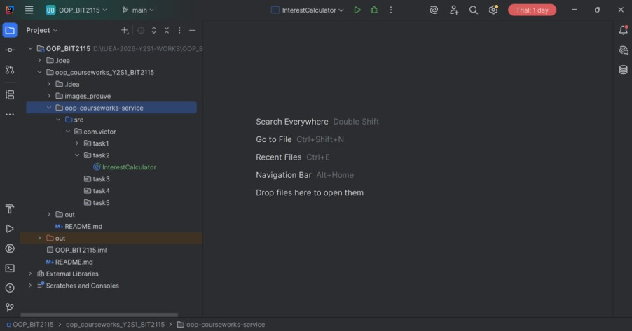
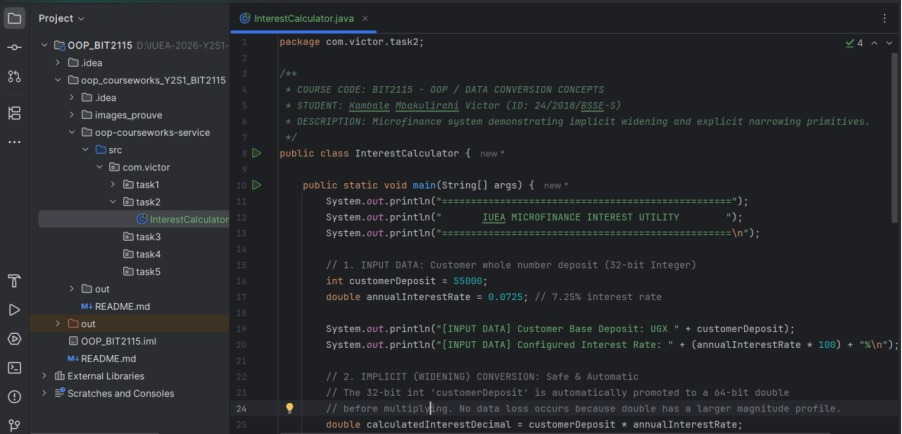
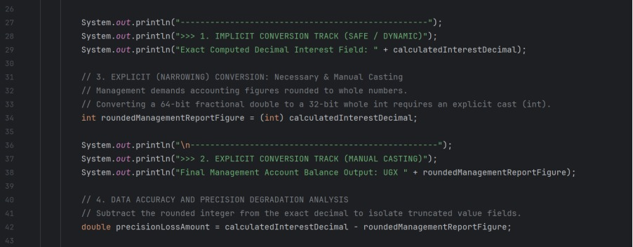
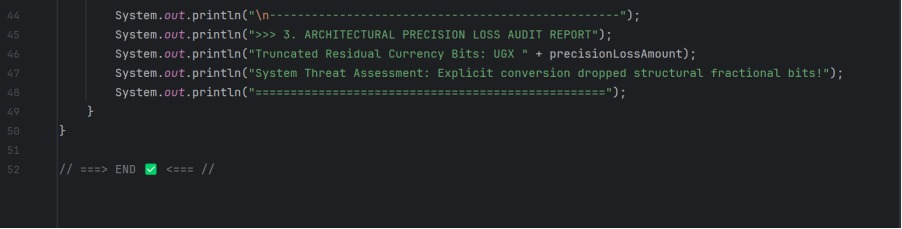
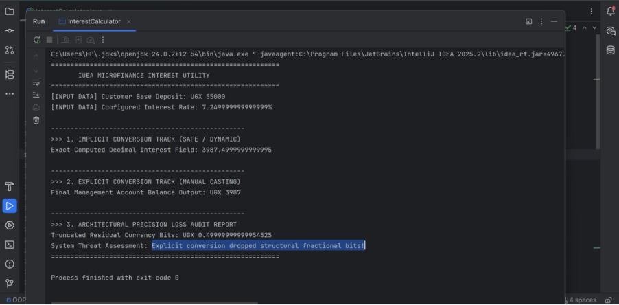

# IUEA Academic Object-Oriented Programming Portfolio
### Course Code: BIT2115 - Object-Oriented Programming (Java Engine Foundations)
**Student Name:** Kambale Mbakulirahi Victor  
**Student ID / Reg Number:** 24/2018/BSSE-S  
**Academic Level:** Year 2, Semester 1 (Software Engineering)
**University:** International University of East Africa (IUEA)

---

## 📂 Repository Assignments Tracking Matrix

### 📌 Task 1: Java Variable Scopes Registry
Demonstrates data layer isolation, memory tracking boundaries, and component lifetimes inside the JVM.

*   **Package Namespace:** `com.victor.task1`
*   **Core Architecture:** Traces Local (Stack), Instance (Heap), and Static (Metaspace) metrics.
*   **Validation Verification Graphics:** Located under `images_prouve/Asset-Task1/`

---

### 📌 Task 2 - Part 1: Explicit & Implicit Data Conversion Engine
Implements an automated microfinance bank savings interest calculator. Showcases widening promotions, manual type-casting constraints, and structural rounding loss thresholds.

*   **Package Namespace:** `com.victor.task2`
*   **Core Implementation Class File:** `InterestCalculator.java`

#### 💻 Java Source Solution Code Blueprint
```java
package com.victor.task2;

/**
 * COURSE CODE: BIT2115 - OOP / DATA CONVERSION CONCEPTS
 * STUDENT: Kambale Mbakulirahi Victor (ID: 24/2018/BSSE-S)
 * DESCRIPTION: Microfinance system demonstrating implicit widening and explicit narrowing primitives.
 */
public class InterestCalculator {
    public static void main(String[] args) {
        System.out.println("==================================================");
        System.out.println("       IUEA MICROFINANCE INTEREST UTILITY        ");
        System.out.println("==================================================\n");

        int customerDeposit = 55000; 
        double annualInterestRate = 0.0725; 

        System.out.println("[INPUT DATA] Customer Base Deposit: UGX " + customerDeposit);
        System.out.println("[INPUT DATA] Configured Interest Rate: " + (annualInterestRate * 100) + "%\n");

        double calculatedInterestDecimal = customerDeposit * annualInterestRate;
        
        System.out.println("--------------------------------------------------");
        System.out.println(">>> 1. IMPLICIT CONVERSION TRACK (SAFE / DYNAMIC)");
        System.out.println("Exact Computed Decimal Interest Field: " + calculatedInterestDecimal);

        int roundedManagementReportFigure = (int) calculatedInterestDecimal;

        System.out.println("\n--------------------------------------------------");
        System.out.println(">>> 2. EXPLICIT CONVERSION TRACK (MANUAL CASTING)");
        System.out.println("Final Management Account Balance Output: UGX " + roundedManagementReportFigure);

        double precisionLossAmount = calculatedInterestDecimal - roundedManagementReportFigure;
        
        System.out.println("\n--------------------------------------------------");
        System.out.println(">>> 3. ARCHITECTURAL PRECISION LOSS AUDIT REPORT");
        System.out.println("Truncated Residual Currency Bits: UGX " + precisionLossAmount);
        System.out.println("System Threat Assessment: Explicit conversion dropped structural fractional bits!");
        System.out.println("==================================================");
    }
}
```

---

## 📊 Proof of Implementation (Verification Results)

### 📁 Task 2 Graphic Validations

#### 1. IDE Project Tree Structure Layout
*Clean package configuration tracking `InterestCalculator.java` structure alignments:*






#### 2. Successful Execution Console Runtime Output
*Verified execution console window proving functional data truncation readouts:*



---

## 🛠️ Version Control Audit Trails
*   **Target Production Environment Branch:** `main`
*   **Latest Deployment Hash (Commit ID):** `f1280bb`
*   **Pipeline Operations Tracking Keyword:** `feat: implement task2 data conversion and organize asset directory trees`


