# IUEA Academic Object-Oriented Programming Portfolio
### Course Code: BIT2115 - Object-Oriented Programming (Java Engine Foundations)
**Student Name:** Kambale Mbakulirahi Victor  
**Student ID / Reg Number:** 24/2018/BSSE-S  
**Academic Level:** Year 2, Semester 1 (Software Engineering)
**University:** International University of East Africa (IUEA)

---

## 📂 Repository Assignments Tracking Matrix

### 📌 Task 1: Java Variable Scopes Registry
Demonstrates data layer isolation, memory tracking boundaries, and component lifetimes inside the JVM.
*   **Package Namespace:** `com.victor.task1`
*   **Core Architecture:** Traces Local (Stack), Instance (Heap), and Static (Metaspace) metrics.
*   **Validation Verification Graphics:** Located under `images_prouve/Asset-Task1/`

---

### 📌 Task 2 - Part 1: Explicit & Implicit Data Conversion Engine
Implements an automated microfinance bank savings interest calculator showcasing widening promotions, manual type-casting constraints, and structural rounding loss thresholds.
*   **Package Namespace:** `com.victor.task2.part1`
*   **Core Implementation Class File:** `InterestCalculator.java`
*   **Validation Verification Graphics:** Located under `images_prouve/Asset-Task2-Part1/`

#### 💻 Java Source Solution Code: `InterestCalculator.java`
```java
package com.victor.task2.part1;

/**
 * COURSE CODE: BIT2115 - OOP / DATA CONVERSION CONCEPTS
 * STUDENT: Kambale Mbakulirahi Victor (ID: 24/2018/BSSE-S)
 * DESCRIPTION: Microfinance system demonstrating implicit widening and explicit narrowing primitives.
 */
public class InterestCalculator {
    public static void main(String[] args) {
        System.out.println("==================================================");
        System.out.println("       IUEA MICROFINANCE INTEREST UTILITY        ");
        System.out.println("==================================================\n");

        int customerDeposit = 55000; 
        double annualInterestRate = 0.0725; 

        System.out.println("[INPUT DATA] Customer Base Deposit: UGX " + customerDeposit);
        System.out.println("[INPUT DATA] Configured Interest Rate: " + (annualInterestRate * 100) + "%\n");

        double calculatedInterestDecimal = customerDeposit * annualInterestRate;
        
        System.out.println("--------------------------------------------------");
        System.out.println(">>> 1. IMPLICIT CONVERSION TRACK (SAFE / DYNAMIC)");
        System.out.println("Exact Computed Decimal Interest Field: " + calculatedInterestDecimal);

        int roundedManagementReportFigure = (int) calculatedInterestDecimal;

        System.out.println("\n--------------------------------------------------");
        System.out.println(">>> 2. EXPLICIT CONVERSION TRACK (MANUAL CASTING)");
        System.out.println("Final Management Account Balance Output: UGX " + roundedManagementReportFigure);

        double precisionLossAmount = calculatedInterestDecimal - roundedManagementReportFigure;
        
        System.out.println("\n--------------------------------------------------");
        System.out.println(">>> 3. ARCHITECTURAL PRECISION LOSS AUDIT REPORT");
        System.out.println("Truncated Residual Currency Bits: UGX " + precisionLossAmount);
        System.out.println("System Threat Assessment: Explicit conversion dropped structural fractional bits!");
        System.out.println("==================================================");
    }
}
```

---

### 📌 Task 2 - Part 2: Secure Medical Registry (Java Access Modifiers)
Implements an encapsulated access control system for a private hospital layout. Restricts data visibility between medical staff roles and locks administrative department billing operations.
*   **Medical Package Namespace:** `com.victor.task2.part2.records`
*   **Administrative Package Namespace:** `com.victor.task2.part2.admin`
*   **Validation Verification Graphics:** Located under `images_prouve/Asset-Task2-Part2/`

#### 💻 Java Source Solution Code Blueprints

##### 1. `PatientProfile.java`
```java
package com.victor.task2.part2.records;

public class PatientProfile {
    private String medicalDiagnosis;
    private String prescribedMedication;
    public String patientName;
    public String appointmentDate;

    public PatientProfile(String patientName, String appointmentDate, String medicalDiagnosis, String prescribedMedication) {
        this.patientName = patientName;
        this.appointmentDate = appointmentDate;
        this.medicalDiagnosis = medicalDiagnosis;
        this.prescribedMedication = prescribedMedication;
    }

    public String getMedicalDiagnosis() {
        return this.medicalDiagnosis;
    }

    public void updatePrescription(String newMedication) {
        this.prescribedMedication = newMedication;
    }

    public String getPrescribedMedication() {
        return this.prescribedMedication;
    }
}
```

##### 2. `FinancialRecord.java`
```java
package com.victor.task2.part2.admin;
import com.victor.task2.part2.records.PatientProfile;

public class FinancialRecord {
    double hospitalAdmissionFee;
    double pharmacyTotalCost;

    public FinancialRecord(double hospitalAdmissionFee, double pharmacyTotalCost) {
        this.hospitalAdmissionFee = hospitalAdmissionFee;
        this.pharmacyTotalCost = pharmacyTotalCost;
    }

    void displayDepartmentalBilling() {
        double totalInvoice = this.hospitalAdmissionFee + this.pharmacyTotalCost;
        System.out.println(">>> [ADMIN CONFIDENTIAL] Departmental Financial Invoice: UGX " + totalInvoice);
    }

    public static void main(String[] args) {
        System.out.println("==================================================");
        System.out.println("         IUEA PRIVATE HOSPITAL RECORD SYSTEM       ");
        System.out.println("==================================================\n");

        PatientProfile patient = new PatientProfile("Kavira Asya", "2026-10-05", "Acute Malaria Syndrome", "Artesunate 60mg Injection");

        System.out.println("--------------------------------------------------");
        System.out.println(">>> [RECEPTIONIST VIEW ACCESSING BASIC DETAILS]");
        System.out.println("Patient Identity Name: " + patient.patientName);
        System.out.println("Scheduled Appointment: " + patient.appointmentDate);

        System.out.println("\n--------------------------------------------------");
        System.out.println(">>> [DOCTOR VIEW ACCESSING SECURE MEDICAL LOGS]");
        System.out.println("Verified Clinical Diagnosis: " + patient.getMedicalDiagnosis());
        System.out.println("Active Prescribed Medication: " + patient.getPrescribedMedication());
        
        patient.updatePrescription("Coartem 80/480mg Tablets");
        System.out.println(">>> [CLINICAL UPDATE] New Medication Saved: " + patient.getPrescribedMedication());

        System.out.println("\n--------------------------------------------------");
        FinancialRecord adminRecord = new FinancialRecord(45000.00, 32000.00);
        adminRecord.displayDepartmentalBilling();
        System.out.println("==================================================");
    }
}
```

---

## 📊 Proof of Implementation (Verification Results)

### 📁 Task 2 Graphic Validations

#### 1. Task 2 Part 1: IDE Layout & Console Outputs
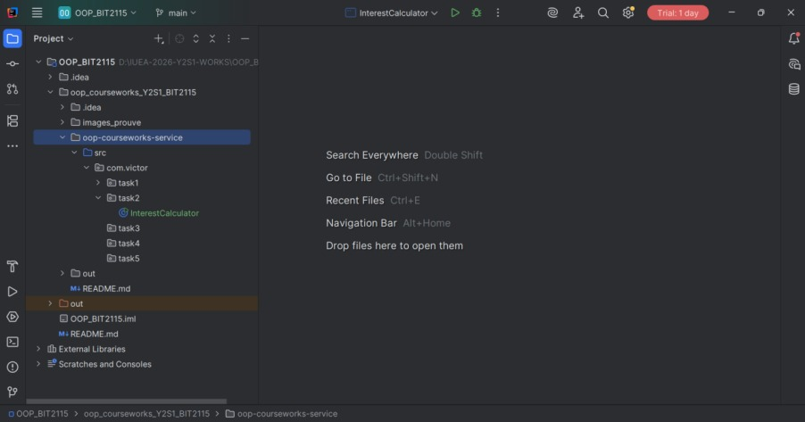
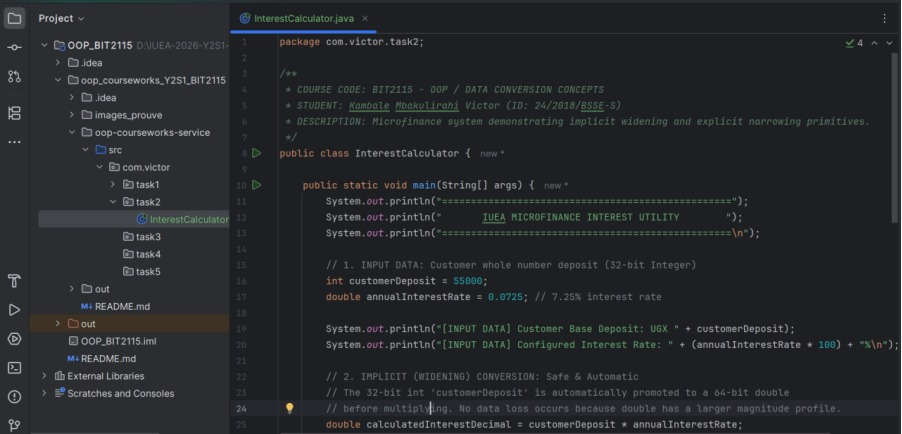
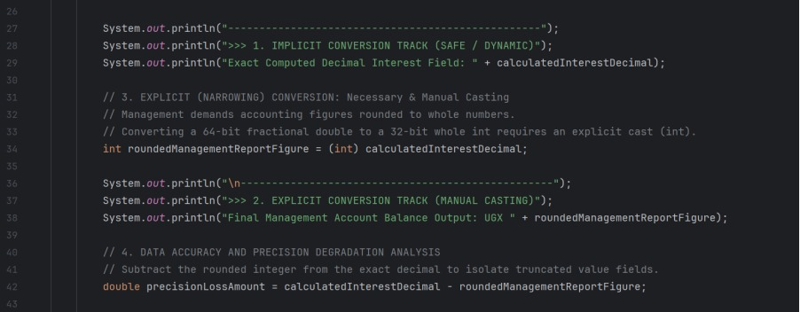
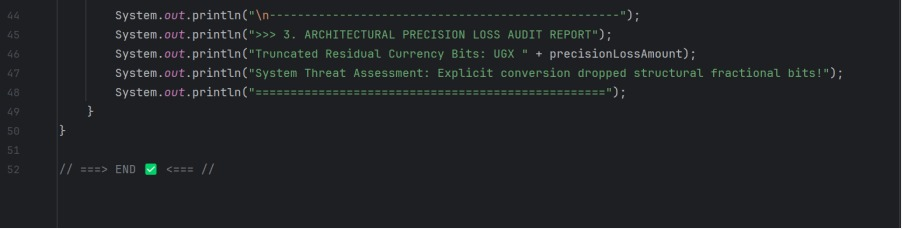
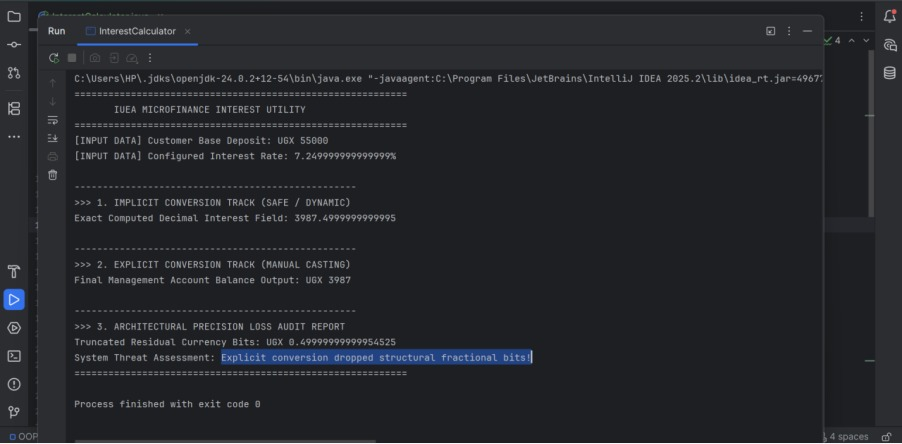

#### 2. Task 2 Part 2: IDE Layout & Console Outputs
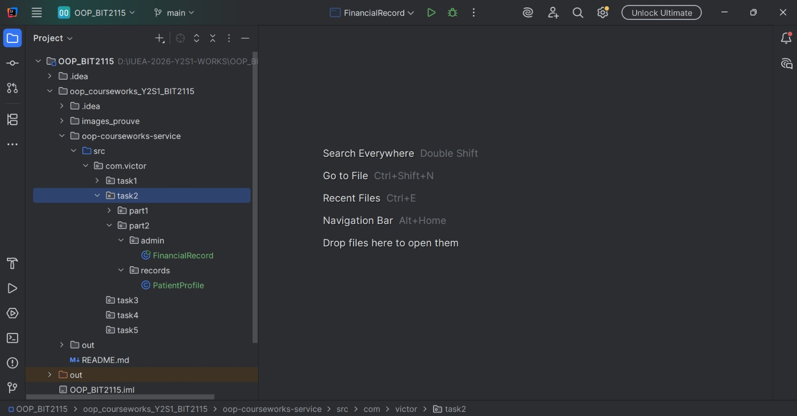
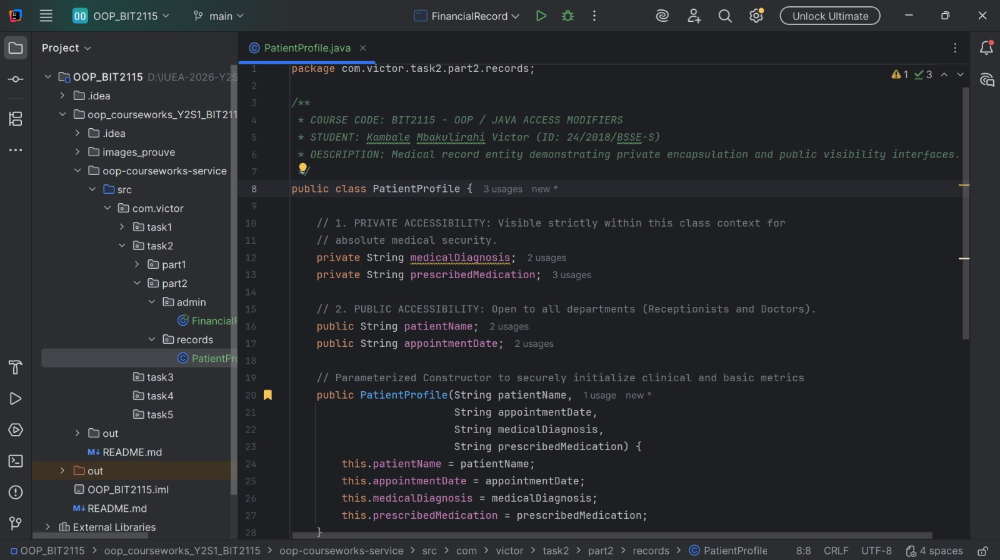
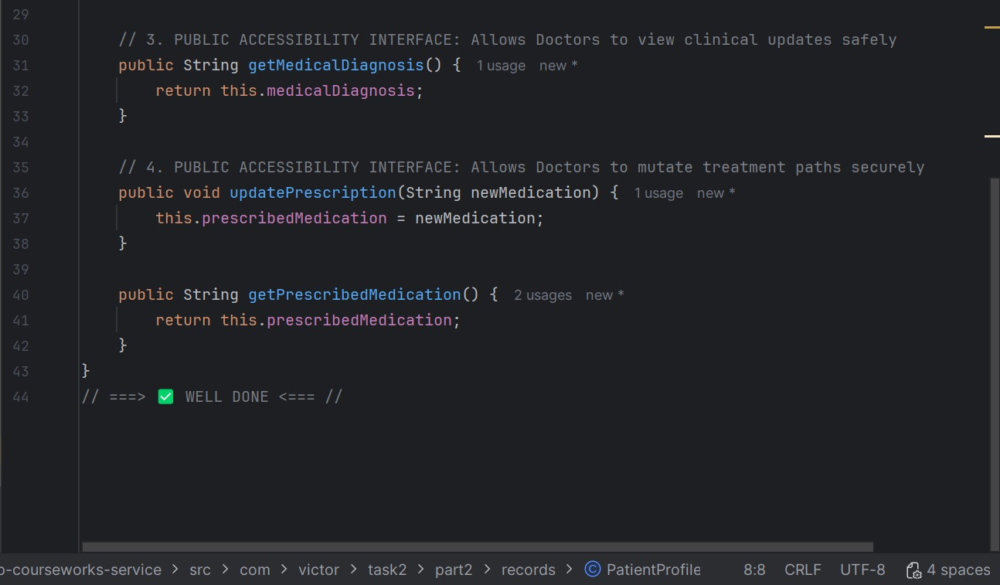
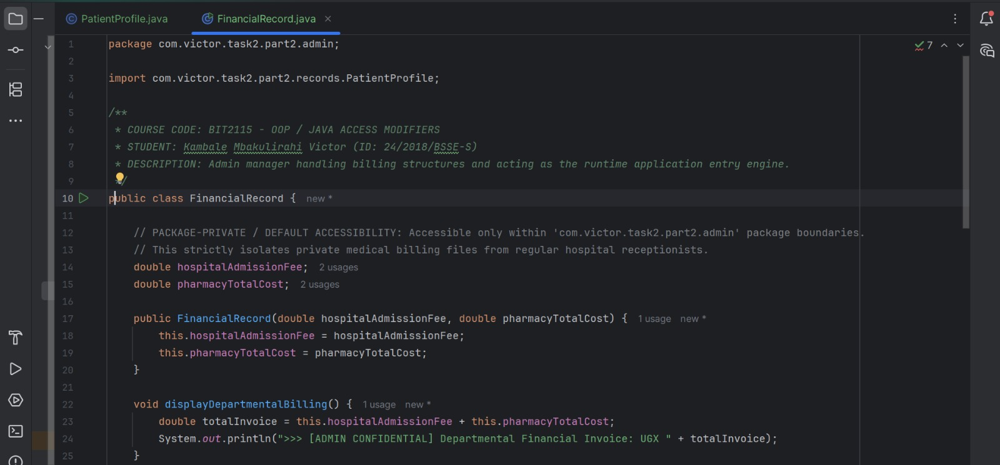
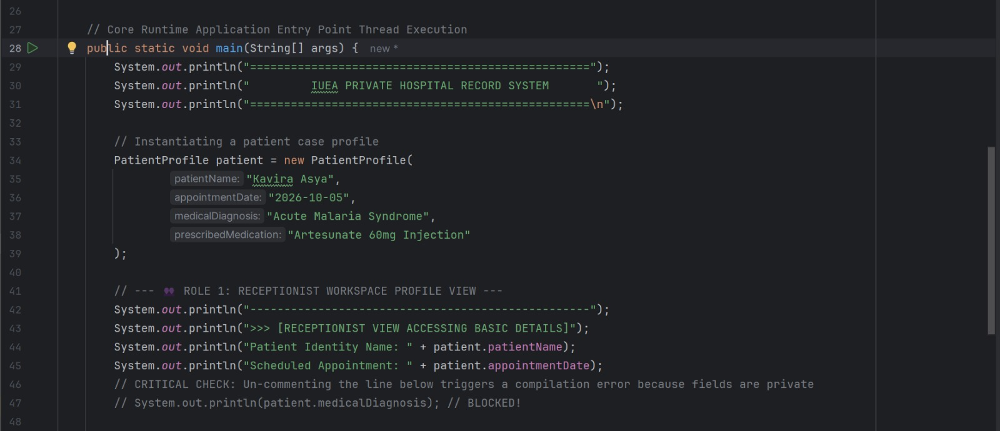
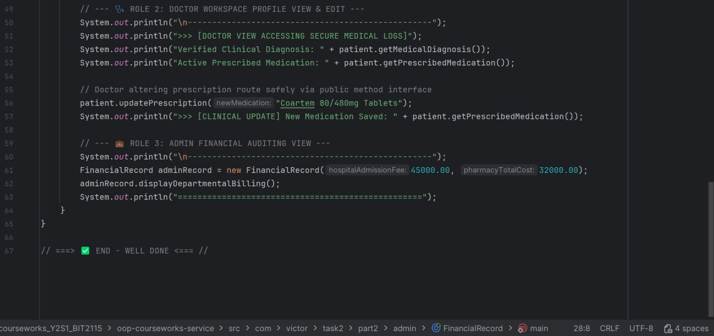
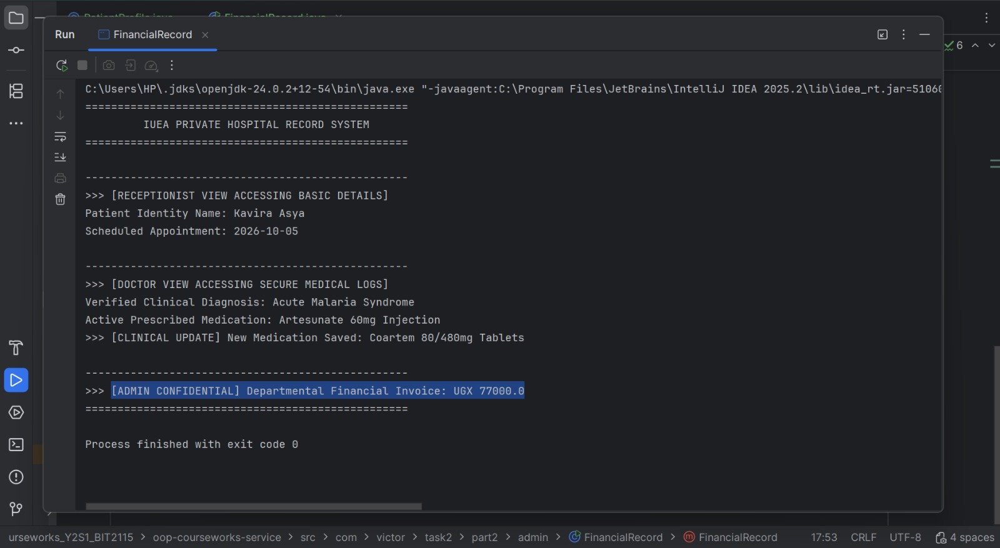

---

## 🛠️ Version Control Audit Trails
*   **Target Production Environment Branch:** `main`
*   **Latest Deployment Hash (Commit ID):** `34d0d46`
*   **Pipeline Operations Tracking Keyword:** `feat: implement task2 part2 access modifiers and upload graphics assets`
